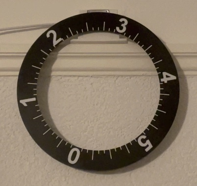

# 6hclock.com

Most clocks divide the day into two halves of twelve hours each. However, this clock divides the day into four quarters of six hours each as has been done already in the past: [six hour clocks](https://en.wikipedia.org/wiki/Six-hour_clock).

The clock's wheel advances every 5 minutes, the current time is indicated at the top. In the picture below it is 02:40, 08:40, 14:40, or 20:40.

The [repository](https://github.com/albrecht-lindner/6hclock) contains everything needed to build this clock: CAD data for your 3D printer, code (CircuitPython), PCB production data, and the necessary hardware components.

---

